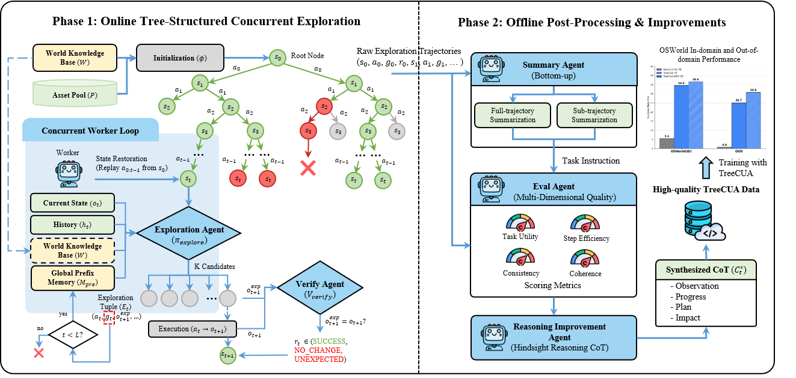

# TreeCUA: Efficiently Scaling GUI Automation with Tree-Structured Verifiable Evolution

<div align="center">

[](https://opensource.org/licenses/Apache-2.0)
[](https://huggingface.co/datasets/jdy18/TreeCUA-Datasets/)
[](https://arxiv.org/abs/2602.09662)

</div>

## 📖 Introduction

**TreeCUA** is a novel framework for efficiently scaling GUI automation agents through **Tree-Structured Verifiable Evolution**.

Unlike traditional linear data synthesis methods that suffer from redundancy and lack of diversity, TreeCUA reformulates trajectory synthesis as a tree-structured exploration process. By leveraging a multi-agent framework (Exploration, Verification, Summary, and Evaluation agents), we generate high-quality, diverse, and verifiable GUI trajectories.

Key features include:
- **🌲 Tree-Structured Exploration:** Maximizes node reuse and eliminates redundant exploration of shallow functional entry points.
- **✅ Step-Level Verification:** Ensures every action is valid and aligns with the expected visual outcome.
- **🌍 World Knowledge Guidance:** Utilizes official documentation to guide agents toward long-tail, professional functionalities.
- **🔄 Scalable Replay Mechanism:** Enables asynchronous concurrent generation on standard OS environments without native snapshotting.
- **🚀 TreeCUA-DPO:** A novel alignment strategy that uses branching nodes as natural preference pairs for Direct Preference Optimization (DPO).




## 🚀 Open-source Roadmap

- [x] **Tree-Structured Action Trajectories**
- [x] Paper
- [x] Code


## 🔧 Environment Setup

### 1. OSWorld Environment

Follow the official [OSWorld setup guide](https://github.com/xlang-ai/OSWorld) to prepare your VM and environment.

- **Resolution Requirement:** Set desktop resolution to **1024×768** to match the coordinate space.
- **Conda Environment:** Create and activate the OSWorld conda environment with required dependencies.
- **VM Image:** You need a VM image (e.g., `Ubuntu.qcow2`) compatible with your chosen provider (`docker`, `vmware`, `virtualbox`, etc.).

### 2. API Configuration

Copy the template and fill in your API keys:

```bash
cp config/env.template.sh config/env.local.sh
# Edit config/env.local.sh with your API keys and paths
source config/env.local.sh
```

Two separate API backends are used — they use **different protocols** and must not be mixed:

| Module | Format | Env Var Prefix | Typical Model |
|---|---|---|---|
| ExplorationAgent | **Anthropic Messages** (`x-api-key`) | `LLM_API_*` | claude-sonnet-4-5 |
| VerificationAgent | **OpenAI Completions** (`Bearer`) | `VERIFIER_API_*` | gpt-4o-mini |
| Scoring / Post-processing | **OpenAI Completions** (`Bearer`) | `SCORING_API_*` | gpt-4o-mini |

| Env Variable | Description |
|---|---|
| `LLM_API_URL` | Anthropic Messages API endpoint (`/v1/messages`) |
| `LLM_API_KEY` | Anthropic API key (`x-api-key` header) |
| `LLM_MODEL` | Claude model name |
| `VERIFIER_API_URL` | OpenAI-compatible endpoint (`/v1/chat/completions`) |
| `VERIFIER_API_KEY` | OpenAI-compatible API key (`Bearer` header) |
| `VERIFIER_MODEL` | Model for verification (e.g. `gpt-4o-mini`) |
| `SCORING_API_URL` | OpenAI-compatible endpoint for scoring/post-processing |
| `SCORING_API_KEY` | API key for scoring/post-processing |
| `SCORING_MODEL` | Model for scoring (e.g. `gpt-4o-mini`) |
| `WORLD_KNOWLEDGE_PATH` | Path to world knowledge JSON. A simplified version is provided at `data_resource/world_knowledge.json`. |
| `RESOURCE_DIR` | Path to test resources (images, docs, etc.) |

### 3. Download Dataset

Download the TreeCUA-Datasets from [Hugging Face](https://huggingface.co/datasets/jdy18/TreeCUA-Datasets) and place it under `data_cache/TreeCUA_Datasets/`.

The dataset has two parts:

| Part | Path | Purpose |
|---|---|---|
| **Static assets** | `data_resource/` | Images, documents, code project zips, etc. Required by both exploration and replay to set up VM initial states. |
| **Exploration trees** | `trees/` | Pre-generated action sequences (`config.json` + `nodes.jsonl`). Use the replay script to reconstruct our full trajectories with screenshots. |

```bash
mkdir -p data_cache
ln -s /path/to/TreeCUA_Datasets data_cache/TreeCUA_Datasets
```

The expected layout:

```text
data_cache/TreeCUA_Datasets/
├── trees/                     # Exploration trees (for replay)
│   ├── chrome/
│   ├── .../
└── data_resource/             # Static assets (for exploration & replay)
```

The dataset path is configurable — pass `--dataset_dir` to the replay script, or symlink to `data_cache/TreeCUA_Datasets/`.


## 🔧 Exploration Code Usage

The pipeline has two phases: an **online** explore-verify loop that generates tree-structured trajectories on a VM, and **offline** post-processing that scores and annotates the results.

### Online Phase — Exploration

[`scripts/exploration/run_exploration_template.sh`](scripts/exploration/run_exploration_template.sh) is the recommended entry point for batch exploration. It iterates over configured workload categories, invoking [`exploration/run_tree_exploration.py`](exploration/run_tree_exploration.py) for each. The Python script spawns N parallel workers, each running an explore-verify loop on a VM: the `ExplorationAgent` proposes candidate actions, actions are executed, and the `VerificationAgent` validates before/after screenshots.

```bash
# Batch: edit WORKLOADS in the script, then run
source config/env.local.sh
./scripts/exploration/run_exploration_template.sh

# Or run a single domain directly
python exploration/run_tree_exploration.py \
    --domain gimp \
    --sub_category "Image Editing" \
    --model "$LLM_MODEL" \
    --api_base_url "$LLM_API_URL" \
    --api_key "$LLM_API_KEY" \
    --path_to_vm /path/to/Ubuntu.qcow2 \
    --provider_name docker \
    --num_envs 2 \
    --max_trajectories 500 \
    --max_steps_exploration 20 \
    --results_base_dir ./exploration_results
```

### Offline Phase — Post-Processing

[`scripts/post_process/run_post_processing.py`](scripts/post_process/run_post_processing.py) runs four steps over a completed session directory: quality scoring, overall task summarization, stage breakdown (`EFFECTIVE`/`NAVIGATION`/`NOISE`), and per-step reason synthesis.

```bash
python scripts/post_process/run_post_processing.py \
    --session_dir ./exploration_results/<session_name>
```


## Trajectory Dataset

The [**TreeCUA-Datasets**](https://huggingface.co/datasets/jdy18/TreeCUA-Datasets) provides a portion of our exploration tree data covering classic OSWorld desktop applications — each tree captures a structured exploration of an app's functionality, branching from a shared initial state into diverse user goals. We provide the **environment configurations** and **action sequences** (exploration trees). To obtain visual observations (screenshots) and full trajectories, users need to **replay** these actions within the OSWorld environment.

### File Descriptions

*   **`trees/`**: The core logic of the exploration.
    *   **`config.json`**: Defines the initial state of the virtual machine. **Note:** This file references external assets (e.g., codebases, documents) located in the `data_resource/` directory. You must ensure `data_resource/` is accessible when initializing the environment.
    *   **`nodes.jsonl`**: A JSON Lines file where each line represents a node (state) in the exploration tree. It contains the action taken to reach this state and verification results.

*   **`data_resource/`**: Contains static assets required to set up the tasks (e.g., zip files of code projects for VS Code tasks, images for GIMP tasks).

### Data Format Example (`nodes.jsonl`)

```json
{"node_id": "node_03_0349c777", "parent_node_id": "node_02_80671614", "root_node_id": "root_001_4bb91e98", "depth": 3, "step_action": [{"action": "left_click", "coordinate": [97, 140]}, {"action": "wait", "duration": 1}], "step_goal": "Navigate to 'You and Google' settings to manage user profile and account information", "verification_result": "SUCCESS", "meta": {"app": "chrome", "category": "Browser Configuration & Personalization"}}
```

*   `node_id`: Unique identifier for the current state.
*   `parent_node_id`: The ID of the previous state.
*   `step_action`: The action executed to transition from the parent node to the current node.
*   `step_goal`: A natural language description of the specific objective or intent for the action performed at this step.
*   `verification_result`: Whether the action was executed successfully as verified by our verifier.

---

### Usage & Replay Guide

To reconstruct the full dataset (including screenshots), you need to replay the action sequences within an OSWorld environment. We provide the `scripts/replay.py` tool to automate this process.

### 1. Running the Replay
The replay script uses OSWorld's `DesktopEnv` to initialize each task configuration, then replays every root-to-leaf path in the exploration tree, capturing screenshots at each step.

```bash
# Replay all trees for all apps
python scripts/replay.py \
    --dataset_dir ./data_cache/TreeCUA_Datasets \
    --output_dir ./replay_output \
    --provider_name docker \
    --path_to_vm /path/to/Ubuntu.qcow2

# Replay a specific app
python scripts/replay.py \
    --dataset_dir ./data_cache/TreeCUA_Datasets \
    --output_dir ./replay_output/chrome \
    --app chrome

# Replay a single tree
python scripts/replay.py \
    --dataset_dir ./data_cache/TreeCUA_Datasets \
    --output_dir ./replay_output \
    --tree_id root_001_4bb91e98 \
    --headless
```

**CLI arguments:**

| Argument | Description |
|---|---|
| `--dataset_dir` | Path to the downloaded TreeCUA_Datasets root (contains `trees/` and `data_resource/`). |
| `--output_dir` | Directory to save replayed trajectories and screenshots. |
| `--provider_name` | OSWorld provider: `docker`, `vmware`, `virtualbox`, `aws`, `azure`, `gcp`, `aliyun`, `volcengine`, `fastvm` (default: `docker`). |
| `--path_to_vm` | Path to the VM image (required for vmware/virtualbox). |
| `--app` | Filter: only replay trees for this app (e.g., `chrome`, `gimp`). |
| `--tree_id` | Filter: only replay this specific tree. |
| `--headless` / `--no-headless` | Run the VM GUI-less or visible (default: headless). |
| `--sleep_after_execution` | Seconds to wait after each action (default: `2.0`). |

### 2. Output Structure
The replay output matches the exploration pipeline's session directory layout, so you can run post-processing on it directly:

```
replay_output/
├── nodes/                  # Node JSONs (Node.to_dict() format)
│   ├── root_001_xxx.json
│   ├── node_01_xxx.json
│   └── ...
├── screenshots/            # Screenshot per node
│   ├── root_001_xxx.png
│   ├── node_01_xxx.png
│   └── ...
└── trajectories/           # One manifest per root-to-leaf path
    └── traj_a1b2c3d4e5f6/
        └── traj_a1b2c3d4e5f6.json
```

Each trajectory manifest follows the same format as `create_trajectory_manifest()`, with:
- **`node_path`**: Ordered node IDs from root to leaf.
- **`traj_detail`**: Per-step entries with `{step, goal, action, reason, verification_result}`.
- **`final_task`**: Empty (`{}`) — to be populated by post-processing.

After replay, run the post-processing pipeline:
```bash
python scripts/post_process/run_post_processing.py \
    --session_dir ./replay_output
```

### 3. Action Space
The `step_action` format in `nodes.jsonl` follows the **Anthropic Computer Use** action specification. Coordinates are in **1024×768** screen space.

## 🏆 Model Zoo & Performance

We provide models trained on TreeCUA data, based on **Qwen2.5-VL-7B**.

| Model | Base Model | Method | OSWorld (ID) | OOD Benchmark | 
| :--- | :--- | :--- | :---: | :---: | 
| **Qwen2.5-VL-7B** |  |  | **5.5%** | **0.8%** | 
| **TreeCUA-7B** | Qwen2.5-VL-7B | SFT (2-Stage) | **34.6%** | **26.1%** | 
| **TreeCUA-DPO-7B** | Qwen2.5-VL-7B | SFT + DPO | **36.6%** | **28.1%** |  

*Detailed benchmark results and analysis are available in the paper.*

---
	

## 📧 Citation

If you find this work useful, please cite our paper:
```bibtex
@article{jiang2025treecua,
  title={TreeCUA: Efficiently Scaling GUI Automation with Tree-Structured Verifiable Evolution},
  author={Jiang, Deyang and Huang, Jing and Zhao, Xuanle and Chen, Lei and Zheng, Liming and Liu, Fanfan and Qiu, Haibo and Shi, Peng and Zeng, Zhixiong},
  journal={arXiv preprint arXiv:2602.09662},
  year={2025}
}
```
***
